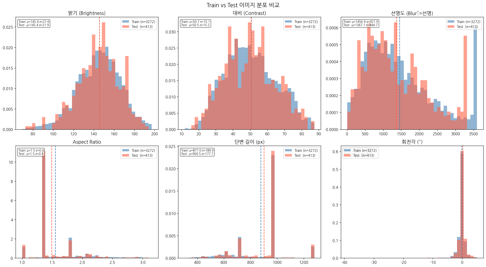

# OCR 텍스트 검출 대회 실험 보고서

## 1. 데이터 분포 분석

### 인사이트
Train과 Test 이미지의 분포를 분석한 결과, **두 분포가 거의 동일**하다는 것을 확인했다.

| 항목 | Train | Test |
|---|---|---|
| 밝기 | 유사 | 유사 |
| 선명도 | 유사 | 유사 |
| 이미지 크기 | 유사 | 유사 |
| 회전각 (90th percentile) | 2° | 1.5° |

### 수정 사항
- 강한 augmentation이 오히려 성능을 낮춘다는 결론 도출
- **HorizontalFlip(p=0.5)만 사용**하는 basic aug 전략 채택 (v12)
- ColorJitter, 회전 augmentation 등 제거

---

## 2. shrink_ratio 실험

### 인사이트
DBNet의 shrink_ratio는 GT 텍스트 영역을 학습 시 얼마나 축소시킬지 결정한다.
값이 낮을수록 Precision↑, 높을수록 Recall↑.

| preset | shrink_ratio | H-Mean | Precision | Recall |
|---|---|---|---|---|
| v4 | 0.4 | 0.9817 | 0.9840 | 0.9800 |
| v11 | 0.5 | 0.9800 | 0.9767 | 0.9838 |
| **v12** | **0.45** | **0.9810** | **0.9776** | **0.9849** |

### 수정 사항
- **sr=0.45**가 Precision/Recall의 균형이 가장 좋음 → v12 기본값으로 채택

---

## 3. box_thresh 튜닝

### 인사이트
box_thresh는 검출 박스의 confidence 최소값으로, 높일수록 Precision↑, Recall↓.
v12 기준으로 **bt=0.35에서 최고점**을 기록하였다.

| box_thresh | H-Mean | Precision | Recall |
|---|---|---|---|
| 0.2 | 0.9810 | 0.9776 | 0.9849 |
| 0.3 | 0.9823 | 0.9804 | 0.9845 |
| **0.35** | **0.9826** | **0.9818** | **0.9837** |
| 0.4 | 0.9822 | 0.9825 | 0.9823 |

### 수정 사항
- 기본값 bt=0.2에서 **bt=0.35**로 변경 → +0.0016 향상

---

## 4. 에러 분석

### 인사이트
v12 bt=0.35 체크포인트 기준 val 세트 분석 결과:

| 구분 | 수량 | 비율 |
|---|---|---|
| TP | 35,706 | - |
| FP (오검출) | 8,603 | - |
| FN (미검출) | 11,008 | - |

- **FN의 64%가 500px² 미만 소형 글자** → 가장 큰 약점
- FP 평균 크기 1,463px² → 중형 박스 오검출 패턴
- 소형 글자는 주로 영수증 하단부(사업자번호, 주소 등)에 집중

### 수정 시도
- 1280 해상도 학습(v13), thresh 낮추기, RandomCrop augmentation 등 시도
- 모두 유의미한 개선 없음 → 소형 글자 문제는 구조적 한계로 판단

---

## 5. 해상도 실험 (v13)

### 인사이트
소형 글자 검출을 위해 1280 해상도 + Gradient Accumulation 도입.

- **Gradient Accumulation**: batch_size를 2로 줄여야 하는 메모리 제약을 해결하기 위해 `accumulate_grad_batches=2` 적용
  - 2스텝 그래디언트 누적 → 실질적으로 batch_size=4와 동일한 학습 효과
  - 단, BatchNorm 통계는 실제 batch_size=2 기준으로 계산 → 모델 품질 저하 요인

| 모델 | 해상도 | H-Mean | Precision | Recall |
|---|---|---|---|---|
| v12 bt=0.2 | 1024 | 0.9810 | 0.9776 | 0.9849 |
| v13 bt=0.2 | 1280 | 0.9803 | 0.9777 | 0.9836 |

### 결론
해상도 증가에도 불구하고 Recall 하락. BatchNorm의 배치 크기 민감성으로 인해 모델 품질이 저하된 것으로 분석.

---

## 6. 포스트프로세싱 파라미터 실험

### 6-1. thresh (이진화 임계값)

#### 인사이트
thresh를 낮추면 더 많은 박스가 검출될 것으로 예상했으나, 오히려 **Recall이 하락**했다.

| thresh | H-Mean | Precision | Recall | 박스 수 |
|---|---|---|---|---|
| 0.2 | 0.9826 | 0.9818 | 0.9837 | 44,720 |
| 0.15 | 0.9791 | 0.9776 | 0.9809 | 44,206 |

- thresh를 낮추면 인접 텍스트 blob이 합쳐지면서 **박스 수가 오히려 감소**
- 합쳐진 큰 박스가 개별 GT 박스와 매칭되지 않아 Recall↓

### 6-2. max_candidates

#### 인사이트
300 → 1000으로 늘려도 박스 수 변화 없음.
→ 현재 이미지당 검출 박스가 300개를 넘지 않아 제한이 걸리지 않음.

### 6-3. unclip_ratio

#### 인사이트
DBNet은 shrink된 텍스트 영역을 unclip_ratio로 확장하여 최종 박스를 생성한다.
기본값 2.0 (원 논문 1.5보다 큰 값 사용 중).

- unclip_ratio=1.5로 낮추면 박스가 더 정밀해지고 인접 박스 합침 현상 감소 가능성

---

## 7. 앙상블 실험

### 7-1. NMS 기반 앙상블 (v4 + v12)

#### 인사이트
두 모델의 박스를 합친 후 NMS 적용했으나 **bt=0.2로 실행돼 FP가 급증**했다.

| 방법 | H-Mean | Precision | Recall |
|---|---|---|---|
| v12 bt=0.35 | 0.9826 | 0.9818 | 0.9837 |
| NMS 앙상블 | 0.9720 | 0.9617 | 0.9837 |

### 7-2. Probability Map 평균 앙상블

#### 인사이트
박스 단계가 아닌 raw probability map 단계에서 두 모델의 출력을 평균.
`pred['prob_maps']`를 직접 평균 후 postprocess 적용.

- 50:50 평균, 30:70(v4:v12) 모두 **v12 단독과 동일한 결과(0.9826)**
- 두 모델이 같은 아키텍처, 같은 데이터로 학습되어 **예측 상관관계가 매우 높음**

### 결론
의미 있는 앙상블 효과를 얻으려면 **다양성이 있는 모델** 필요 (다른 아키텍처, 다른 해상도로 수렴된 모델 등)

---

## 8. 최종 실험 요약

| 실험 | H-Mean | 결과 |
|---|---|---|
| v4 (baseline) | 0.9817 | 베이스라인 |
| v11 sr=0.5 | 0.9800 | ↓ |
| v12 sr=0.45 bt=0.2 | 0.9810 | ↑ |
| v12 bt=0.3 | 0.9823 | ↑ |
| **v12 bt=0.35** | **0.9826** | **★ 최고** |
| v12 bt=0.4 | 0.9822 | ↓ |
| v13 1280 bt=0.2 | 0.9803 | ↓ |
| v12 thresh=0.15 | 0.9791 | ↓ |
| v12 1536 inference | 0.9771 | ↓ |
| NMS 앙상블 | 0.9720 | ↓ |
| Prob map 앙상블 | 0.9826 | = |

---

## 9. 핵심 인사이트 요약

1. **Train ≈ Test 분포** → 강한 augmentation 불필요, basic aug(HorizontalFlip)가 최적
2. **shrink_ratio 0.45** → Precision/Recall 균형 최적점
3. **box_thresh 0.35** → confidence 필터링으로 FP 제거하여 H-Mean 향상
4. **소형 글자(500px² 미만)가 FN의 64%** → 해결을 위해 다양한 시도(해상도 증가, RandomCrop 등) 했으나 효과 못봄
5. **thresh 낮추기 역효과** → 박스 병합 현상으로 오히려 박스 수와 Recall 동시 하락
6. **Gradient Accumulation** → 메모리 제약 시 batch_size 보완 가능하나, BatchNorm 통계 문제 존재
7. **동일 구조 모델 앙상블 무효** → 다양성 없으면 앙상블 효과 없음

---

## 10. 개선 가능 방향 (미래 작업)

- **다른 아키텍처와의 앙상블** (CRAFT, PAN++ 등)
- **1280 해상도 + GroupNorm** (BatchNorm 배치 크기 민감성 해결)
- **소형 글자 특화 학습** (focal loss, hard negative mining)
- **Multi-scale training** (다양한 해상도에서 학습하여 스케일 불변성 확보)

---

## 11. 회고

소형 글자(500px² 미만) 검출 문제를 끝내 해결하지 못한 점이 가장 아쉽다. FN의 64%가 소형 글자임을 에러 분석으로 일찍 파악했음에도 불구하고, 해상도 증가(v13 1280), RandomCrop augmentation, thresh 조정 등 시도한 방법들이 모두 유의미한 개선을 만들어내지 못했다. 소형 글자 특화 전략인 focal loss나 tile inference를 초반부터 검토했더라면 다른 결과가 나왔을 수 있다.

또한 앙상블 효과를 기대했으나 v4와 v12가 동일한 아키텍처, 동일한 데이터로 학습되어 예측 상관관계가 매우 높았고, 결과적으로 앙상블이 전혀 효과가 없었다. 처음부터 서로 다른 해상도나 augmentation 전략으로 두 개의 모델을 병행 학습시켰다면 유효한 앙상블로 점수를 더 끌어올릴 수 있었을 것이다. 실험 계획 단계에서 앙상블 다양성을 고려하지 못한 점이 아쉽다.

